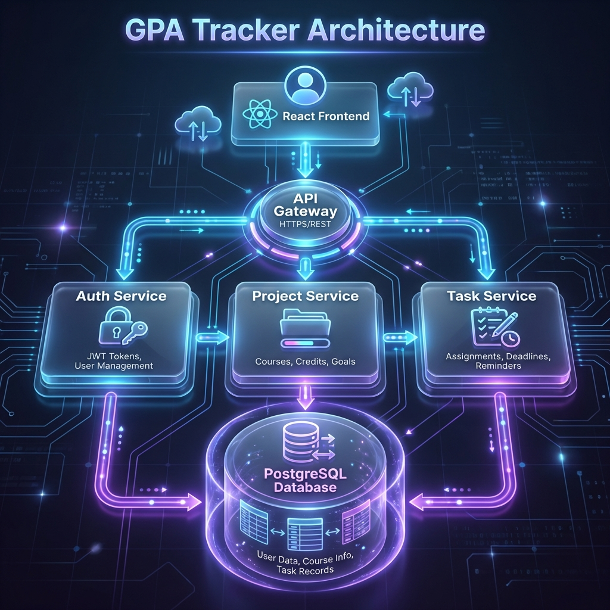
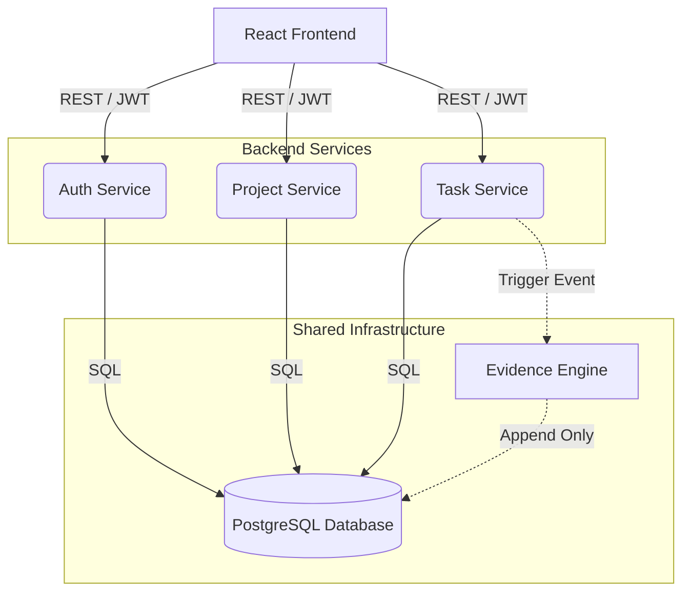
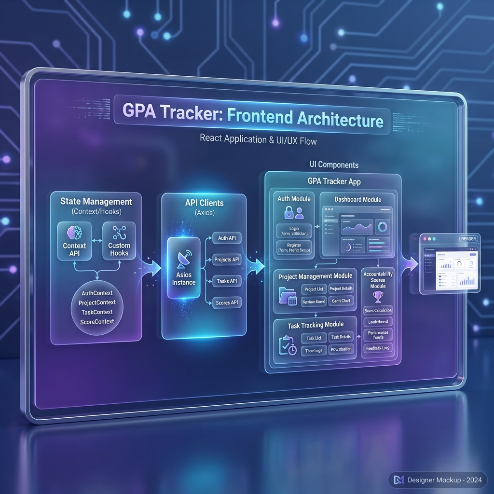
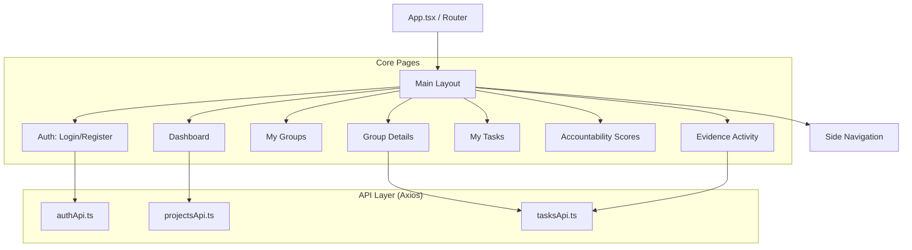
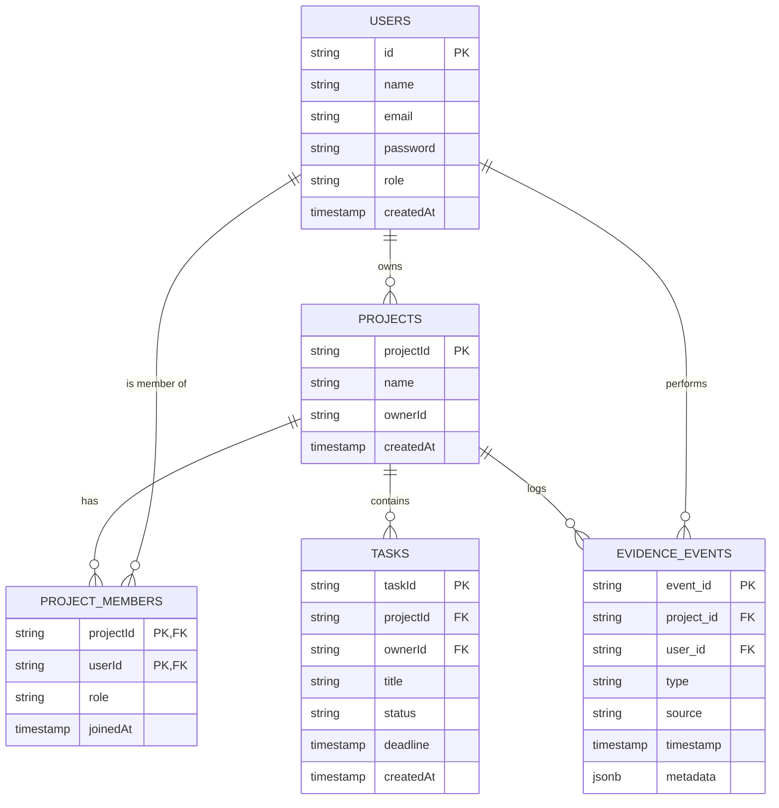

# GPA Tracker - System & Database Design

This document provides a comprehensive overview of the **GPA Tracker** architecture, data flow, database schema, and frontend design.

---

## 🏗️ System Architecture (Full Stack)

The application follows a **Microservices Architecture** with a decoupled React frontend.

### High-Level Component Diagram

---

## 🎨 Frontend Design & Architecture

The frontend is built using **React (Vite)** and **TypeScript**, focusing on a component-based architecture with centralized API management.

### Frontend Component hierarchy

### 🛠️ Frontend Tech Stack
- **Framework**: React 18+ with Vite
- **Language**: TypeScript
- **State Management**: React Hooks (useState/useEffect) & Context API
- **Styling**: Vanilla CSS (Custom Glassmorphic Design)
- **API Client**: Axios with shared instance/interceptors
- **Icons**: Lucide React

---

## 🗄️ Database Design (ERD)

The database uses a relational schema in PostgreSQL. The key design principle is the **Evidence Audit Trail**.

### Entity Relationship Diagram

---

## 📋 Table Descriptions

| Table Name | Description | Key Columns |
| :--- | :--- | :--- |
| **`users`** | Stores user identity, credentials, and roles. | `email` (unique), `password` (hashed) |
| **`projects`** | Project containers created by Owners. | `ownerId`, `name` |
| **`project_members`** | Junction table for Many-to-Many relationship. | `projectId`, `userId`, `role` |
| **`tasks`** | Specific units of work assigned within a project. | `status` (CREATED, IN_PROGRESS, DONE, APPROVED) |
| **`evidence_events`** | **The Audit Log.** Every status change is recorded here. | `type`, `timestamp`, `metadata` |

---

## 🔄 Core Workflow: Action-as-Evidence

1.  **Task Creation**: entry made in `tasks` + `TASK_CREATED` event.
2.  **Member Action**: `tasks` status updated + `STATUS_CHANGED` event with server-side timestamp.
3.  **Leader Validation**: `TASK_APPROVED` event logged.
4.  **Score Calculation**: Backend queries `evidence_events` to calculate the final accountability score based on *validated* work only.
